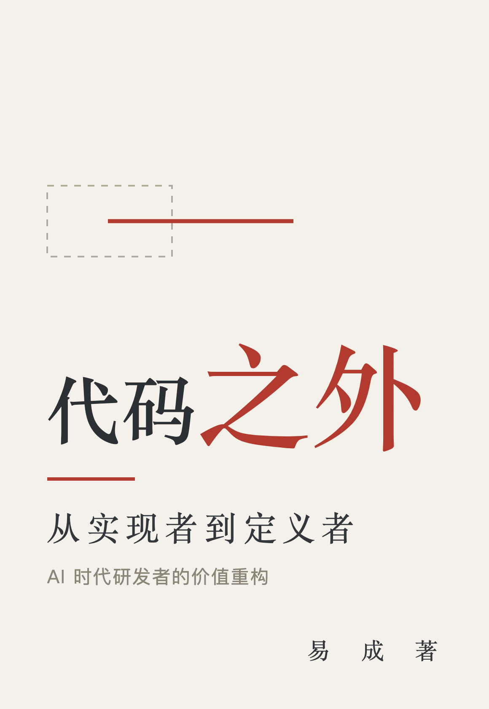

# 代码之外：从实现者到定义者

> AI 把"写代码"这件事的成本压到了接近零。这本书想回答的是——当实现不再稀缺，研发人员的价值到底落在哪。

**这是免费全文。** 不售卖，也不打算售卖。写它是因为这几年被问了太多次同一个问题，一次一次回答不过来。
如果它对你有用，帮我做一件小事就够了：**把链接转给一个你觉得会需要的同事。**

## 这本书回答什么

不是一个使用方法的问题，是一个位置问题。

过去几十年，这行的核心能力是把人的想法翻译成机器能执行的东西。翻译得快、翻得准、少出错，就是熟练度，就是价值。
现在这一层正在被接管，而且速度比大多数人预期的快。**麻烦在于：很多人发现自己更快了，但并没有更安全**——产出翻了倍，话语权没变，反而更忙、更累，更说不清自己好在哪。

这本书试着把这件事拆开：AI 到底吃掉了哪一块，什么反而越来越值钱，一个人能落在哪几个位置上，组织那一侧又该动什么。
里面没有励志故事，也没有"学会这个就不慌"的清单。有的是可自测的模型、具体的人，和每章末尾能当天就做的一两个动作。

## 适合谁读

- 写了几年代码、正在怀疑手里的东西还值不值钱的工程师
- 业务理解得很深但说不清自己贡献在哪的技术专家
- 刚带小组、发现"管人"这件事和想象中不一样的 leader
- 想知道手下那批人为什么又忙又不安全的研发管理者

书里的人物和公司都是化名。一部分来自真实经历，做了匿名和改写；一部分是为说明某个普遍现象构造的典型情境，不指向任何具体个人。
出现的数字用来说明量级和比例，不是统计结论，也不该被当成行业基准。

## 目录

- [序　接下来怎么办](00-%E5%BA%8F-%E6%8E%A5%E4%B8%8B%E6%9D%A5%E6%80%8E%E4%B9%88%E5%8A%9E.md)

**第一部分　看清：到底发生了什么**

- [第 1 章　软件工程史，就是一部翻译史](ch01-%E8%BD%AF%E4%BB%B6%E5%B7%A5%E7%A8%8B%E5%8F%B2.md)
- [第 2 章　什么在贬值，什么在升值](ch02-%E4%BB%80%E4%B9%88%E5%9C%A8%E8%B4%AC%E5%80%BC.md)
- [第 3 章　35 岁线的真相](ch03-35%20%E5%B2%81%E7%BA%BF%E7%9A%84%E7%9C%9F%E7%9B%B8.md)

**第二部分　立身：价值的三个来源**

- [第 4 章　价值公式：为什么同样是 AI，产出差三倍](ch04-%E4%BB%B7%E5%80%BC%E5%85%AC%E5%BC%8F.md)
- [第 5 章　业务理解：为什么它成了立身之本](ch05-%E4%B8%9A%E5%8A%A1%E7%90%86%E8%A7%A3.md)
- [第 6 章　判断力：只能靠做决策、担后果来练](ch06-%E5%88%A4%E6%96%AD%E5%8A%9B.md)

**第三部分　跃迁：能力怎么长出来**

- [第 7 章　OPT：从技能互补到判断互补](ch07-OPT.md)
- [第 8 章　五能阶梯：能做、能写、能说、能讲、能聊](ch08-%E4%BA%94%E8%83%BD%E9%98%B6%E6%A2%AF.md)
- [第 9 章　驾驭者：唯一一条年轻人不吃亏的赛道](ch09-%E9%A9%BE%E9%A9%AD%E8%80%85.md)

**第四部分　落地：个人与组织各自怎么办**

- [第 10 章　小 leader 的两难：向上，还是向下沉](ch10-%E5%B0%8F%20leader%20%E7%9A%84.md)
- [第 11 章　不是更努力，是换维度](ch11-%E4%B8%8D%E6%98%AF%E6%9B%B4%E5%8A%AA%E5%8A%9B.md)
- [第 12 章　组织这一侧：从"管人"到"带领业务发展"](ch12-%E7%BB%84%E7%BB%87%E8%BF%99%E4%B8%80%E4%BE%A7.md)
- [结语　未来在哪](zz-%E7%BB%93%E8%AF%AD-%E6%9C%AA%E6%9D%A5%E5%9C%A8%E5%93%AA.md)

也可以直接读单文件版：[代码之外-全文.md](%E4%BB%A3%E7%A0%81%E4%B9%8B%E5%A4%96-%E5%85%A8%E6%96%87.md)

## 每章长什么样

每章五件：一句把整章拎起来的话、三件要讲的事、正文、一张可以对自己量的模型或清单、以及"可以做的事"——个人和管理者各一份。

四部分的走向：

1. **看清**——到底发生了什么
2. **立身**——价值的三个来源：业务理解、判断力、表达带宽
3. **跃迁**——能力怎么长出来
4. **落地**——个人与组织各自怎么办

## 关于作者

易成，笔名。在安全行业做了十几年，从终端安全产品架构师做起，现在带一条产品线。
看过从单机杀毒到云化终端的几轮换代，这两年主要跟大模型和智能体打交道。不擅长给人生建议，更习惯把事情拆开看。

书中观点均为个人观察，与所在机构无关。

## 你可以怎么用这本书

- **个人读**：按顺序读，每章末尾的"可以做的事"挑一件做
- **团队读书会**：一次一章，讨论"这一章说的现象我们这儿有没有"
- **管理者**：可以重点看第 10-12 章，那三章专门讲组织那一侧
- **二次创作**：欢迎做成 PDF、EPUB、有声、翻译，或者拆成课程与分享材料（见下面协议）

## 许可协议

本作品采用 [知识共享 署名-非商业性使用-相同方式共享 4.0 国际许可协议](http://creativecommons.org/licenses/by-nc-sa/4.0/) 进行许可。

用人话说是：

- **可以**：自由转载、分享、打印、做成任何格式、节选引用、改编成课程或分享材料
- **要做的**：标明出处（作者易成 + 作品名）；衍生作品也用同样的协议开放
- **不可以**：拿去卖，或者放进需要付费才能看的产品里

## 反馈

错别字、逻辑漏洞、你觉得说错的判断、你身边反着的例子——都欢迎提 issue。
这本书还会改，读者的反馈是修订的主要依据。

---

*如果你读到某一句，觉得"这话说的就是我"，那它就没白写。*
